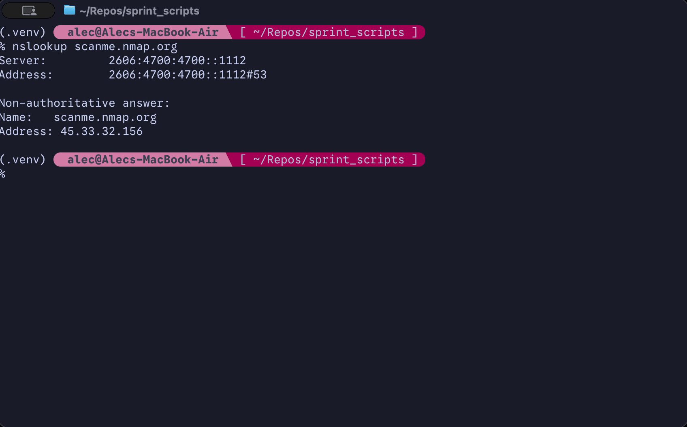

Pretty-printing port scanning and IP geolocator written in Python featuring terminal and CSV output.
Created for SEC444: Security Automation as part of the third sprint (sprint3).

## Description
netrecon takes a public or private IPv4/IPv6 address as a target, and performs two main functions:
- Queries a public IP geolocation API (ip-api.com) to retrieve geolocation data (API key *not* required!) to retrieve:
    - Country & Country Code (i.e. `United States (US)`)
    - City & State/Region (i.e. `Seattle, Washington (WA)`)
    - ISP (i.e. `Akamai Technologies, Inc.`)
- Uses python-nmap to call a local Nmap installation to query the top 1000 ports on the target host
    - Ports are sorted by protocol, listed by port number, service name, and state

After the relevant information is acquired, everything is pretty-printed to the terminal and to a CSV file.

## Getting Started
### Dependencies
- A supported client operating system (macOS or Linux)
- Python 3.9 or later
- [Nmap](https://nmap.org/) 7.99 or later (must be present in $PATH)

#### Additional dependencies
- [certifi 2026.4.22](https://pypi.org/project/certifi)
- [charset-normalizer 3.4.7](https://pypi.org/project/charset-normalizer)
- [idna 3.15](https://pypi.org/project/idna)
- [python-nmap 0.7.1](https://pypi.org/project/python-nmap)
- [requests 2.34.2](https://pypi.org/project/requests)
- [urllib3 2.7.0](https://pypi.org/project/urllib3)
- [markdown-it-py 4.2.0](https://pypi.org/project/markdown-it-py)
- [mdurl 0.1.2](https://pypi.org/project/mdurl)
- [Pygments 2.20.0](https://pypi.org/project/Pygments)
- [rich 15.0.0](https://pypi.org/project/rich)

All module dependencies are listed in `requirements.txt` in the project root.

## Installation
1. Install Nmap (tested on v7.99) using your operating system's preferred method.
    - Windows: Download the latest version of Nmap [here](https://nmap.org/download), or install it with Winget by using `winget install -e --id Insecure.Nmap`.
    - macOS: Download the latest version of Nmap [here](https://nmap.org/download), or install it via Homebrew/MacPorts.
    - Linux: Use your distribution's native package manager (i.e. `apt`, `dnf`, `pacman`).
2. Make sure that Nmap is present in your shell's $PATH by running `nmap` from the terminal. The Nmap version/help text should appear.
3. Navigate to the sprint3-netrecon branch. You can see these instructions, so you're already here. (Yay!)
4. Clone the repository via Git by running `git clone -b sprint3-netrecon https://github.com/cadazzles/sprint_scripts.git` in a terminal, or by downloading a ZIP copy of the current repo state using the **Code** button
5. Navigate to the repo directory once cloned or unzipped.
6. **[RECOMMENDED]** Create a virtual environment to safely install required dependencies by running `python3 -m venv .venv/`. (Note: Some Linux distributions omit python3-virtualenv from their default Python install. Use your distro's package manager to install it.)
7. Activate the virtual environment using the platform specific command: `.\.venv\Scripts\Activate.ps1` for Windows, `source .venv/bin/activate` for macOS/Linux.
8. Install all required dependencies by using `pip install -r requirements.txt`
9. Run the script using `python3 netrecon.py` - see usage instructions below for more information.

### Usage instructions
```
$ python3 netrecon.py <target_ip> <optional: outfile.csv>
```
#### Arguments
`target_ip`: Public or private IP address to perform geolocation and scanning operations against. Using a private IP as a target will disable geolocation.

`outfile.csv`: Absolute or relative path to the desired output file (CSV format). Defaults to `output.csv` in the current working directory when no name is provided.

### Example Usage/Output


## Known Issues
None so far.

## Authors
Alec Wandy - [@cadazzles](https://github.com/cadazzles)\
This script was largely written without assistance from generative AI tools.

## License
This project is licensed under the MIT License - see the LICENSE.md file for details.


