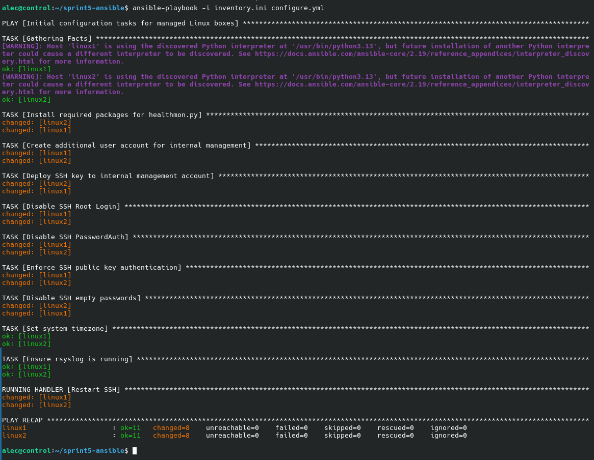
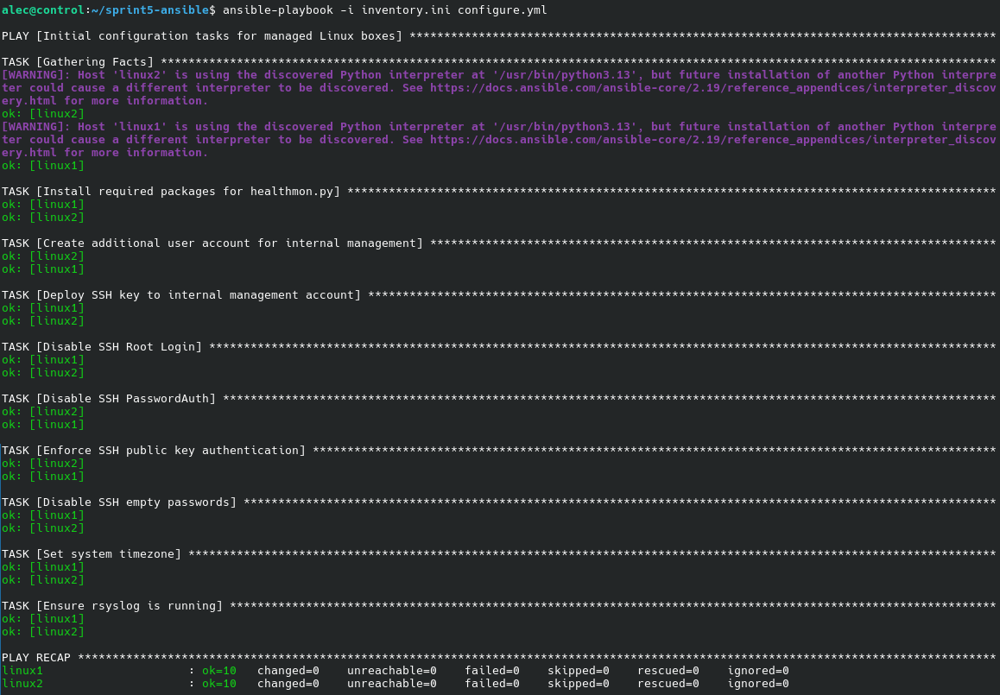
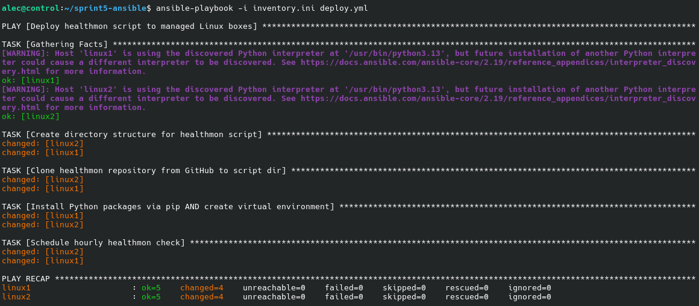
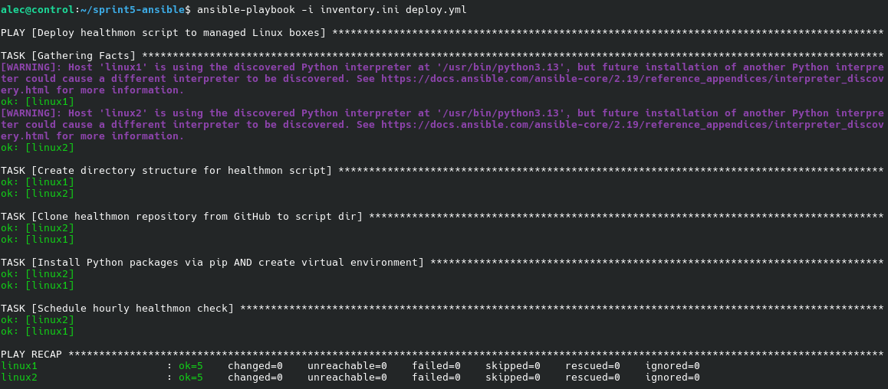

A pair of Ansible playbooks that aim to configure one or more Linux servers with basic automation elements (i.e. create management accounts, harden ssh, install packages, etc),
then clone healthmon (the sprint4 script) into a directory where it is then run on an hourly schedule by cron. Created for SEC444: Security Automation as part of the fifth and final sprint (sprint5).

## Description
configure.yml performs initial configuration tasks for the target Linux servers, including
- Installing package dependencies for healthmon via native package manager (apt, dnf, pacman, etc.)
- Creating an internal management user account (default: `management`)
- Deploying the control node/user's public SSH key to the management account
- SSH hardening
    - Disabling root login
    - Disabling password-based authentication
    - Enforcing public key authentication
    - Disabling empty password login
- Sets system timezone (default: `America/Los_Angeles`)
- Ensures rsyslog is installed and running

deploy.yml builds upon the framework set by configure.yml to setup healthmon via:
- Creating a directory structure for the script to reside in (default: `/opt/healthmon`)
- Cloning the branch from sprint_scripts repository
- Installing required Python packages via `pip` and installing in a virtual environment
- Scheduling healthmon to run using the default config file every hour

## Getting Started
### Dependencies
- A control node that will run Ansible, preferably running Linux
- One or more managed nodes running a modern Linux distribution
- Python 3.9 or later installed on all nodes

#### Additional dependencies (installed automatically)
- [distro 1.9.0](https://pypi.org/project/distro)
- [psutil 7.2.2](https://pypi.org/project/distro)

These are module dependencies specifically for `healthmon`, and are installed automatically by `deploy.yml`.

## Installation
1. Navigate to the sprint5-ansible branch. You can see these instructions, so one last time, you're already here. (Wooooo!)
2. Clone the repository via Git by running `git clone -b sprint5-ansible https://github.com/cadazzles/sprint_scripts.git` in a terminal, or by downloading a ZIP copy of the current repo state using the **Code** button.
3. Navigate to the `sprint_scripts` directory once cloned or unzipped.
4. Install Ansible to your host device using your native package manager (i.e. `sudo apt install ansible`)
5. Ensure that your managed hosts are accessible via SSH. Generate a keypair if you aren't already using one using `ssh-keygen -t ed25519`. This is **important**. You will be locked out of SSH later if you don't have a keypair.
6. Copy your keypair to your managed hosts by using `ssh-copy-id [user]@[managed-host-ip]`. Run this for each host you wish to manage via the playbooks.
7. Check that SSH via public key authentication works (i.e. no password required if you don't have a passphrase set). 
8. **[OPTIONAL]** At this point, you may want to enable passwordless `sudo` on your managed hosts, as we will be disabling password-based remote access as part of `configure.yml`. Enabling passwordless sudo will prevent requiring a password every time the playbooks are invoked.
    - To do so, run `sudo visudo` on your managed hosts, and add `[user] ALL=(ALL) NOPASSWD:ALL`.
9. Adjust the `inventory.ini` file to match your setup - change `ansible_host` to match the IP addresses of your hosts, and `ansible_user` to match your primary user on the host. You can also change the names of the hosts or add/remove hosts as needed.
10. Deploy the playbooks to the managed hosts defined in `inventory.ini` by running the following in order (NOTE: if passwordless sudo was not enabled, you will need to add `-K` or `--ask-become-pass` and supply a sudo password to the end of each command):
    - `ansible-playbook -i inventory.ini configure.yml`
    - `ansible-playbook -i inventory.ini deploy.yml`
11. After running both commands and deploying both playbooks, your managed hosts should be set up in accordance with the description outlined above.

### Usage instructions
`ansible-playbook -i inventory.ini configure.yml`

`ansible-playbook -i inventory.ini deploy.yml`

To change what each playbook does or adjust parameters, edit them in a text editor.

## Screenshots
<figure>
    
    <figcaption>configure.yml being run for the first time.</figcaption>
</figure>

<figure>
    
    <figcaption>configure.yml being run for the second time.</figcaption>
</figure>

<figure>
    
    <figcaption>deploy.yml being run for the first time.</figcaption>
</figure>

<figure>
    
    <figcaption>deploy.yml being run for the second time.</figcaption>
</figure>

## Known Issues
None so far.

## Software Support
These playbooks were written and tested specifically using **Debian 13.5 (trixie)** as both the control node and managed nodes. 

Care has been taken to ensure that the playbooks should work on other Debian-based distributions *and* Red Hat-based distributions (i.e. Fedora, Rocky, RHEL, etc.) or Arch-based distributions, but please keep this in mind before using.

## Authors
Alec Wandy - [@cadazzles](https://github.com/cadazzles)\
These playbooks were largely written without assistance from generative AI tools.

## License
This project is licensed under the MIT License - see the LICENSE.md file for details.
